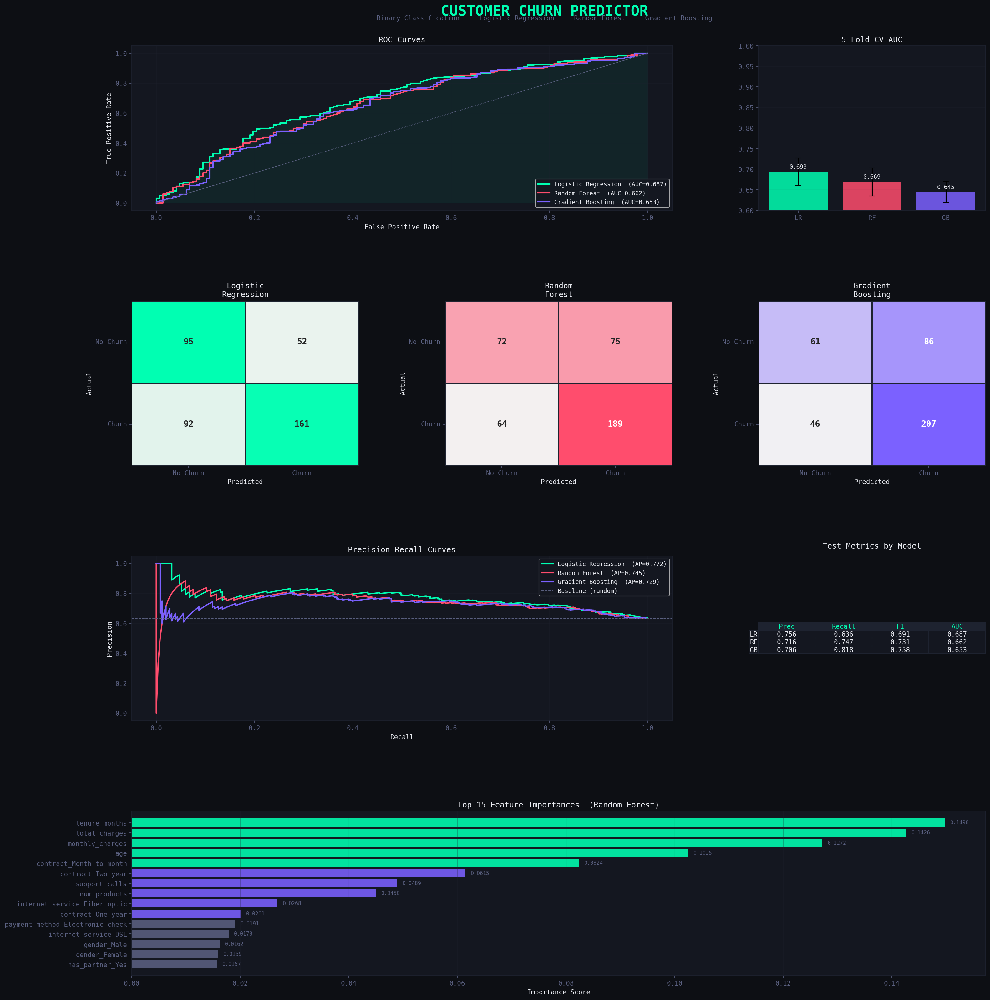

# Customer Churn Predictor

A binary classification ML pipeline to predict customer churn using Scikit-learn.



## Tech Stack
Python · Scikit-learn · Pandas · Matplotlib · Seaborn

## Models
- Logistic Regression
- Random Forest
- Gradient Boosting

## Project Structure
```
customer-churn-predictor/
├── generate_data.py        # Synthetic dataset generator
├── churn_predictor.py      # Full ML pipeline
├── requirements.txt        # Dependencies
├── data/
│   └── customers.csv       # Generated dataset (2000 rows)
└── outputs/
    └── churn_dashboard.png # Evaluation dashboard
```

## How to Run
```bash
pip install -r requirements.txt
python generate_data.py
python churn_predictor.py
```

## Output
Generates a full evaluation dashboard with:
- ROC Curves (all 3 models)
- Confusion Matrices
- Precision-Recall Curves
- Feature Importances (Random Forest)
- Cross-validation AUC scores
